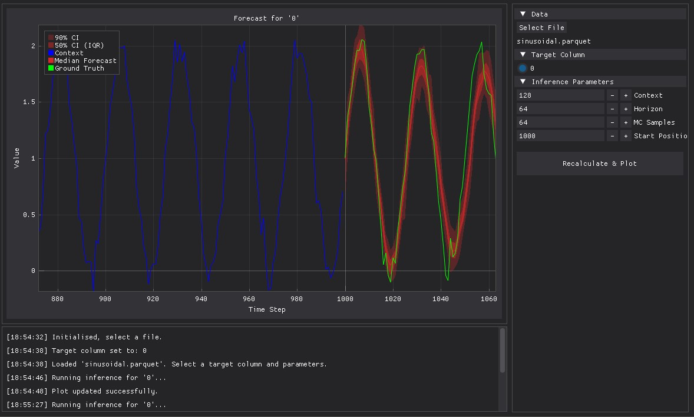

# Probablistic Time Series Forecasting using Transformers

## Highlights
- Based on the causal decoder transformer architecture
- Probablistic predictions which can utilise arbitrary torch.distributions classes
- "Drop-in" variational Bayesian methods for epistemic uncertainty estimation
- Pure PyTorch and Lightning modules available
- Basic time series dataset utilities
- Modular enough that architectural features can be hyperparameters

## Transformer Architecture
- Decoder only (GPT-style)
- Rotary Positional Embeddings (RoPE)
- Accelerated scaled dot product attention via Torch Flash Attention implementation
- RMSNorm pre-normalisation on FFN
- Gated Linear Unit FFN (SwiGLU/GeGLU)
- Key value caching

## Model Details
### Instance Normalisation
Each input sequence is standardised (scaled) by an instance normalisation layer. The model learns to make predictions in the normalised space of the context. An inverse denormalisation step is applied to the output samples to transform back to the context space. The instance normalisation layer is scaled once at the start of inference rollout so that the KV cache isn't invalidated.

### Dropout
Dropout is applied to the residual sum after the attention unit, residual sum after the FFN, and to the embedding layer. Each dropout probability can be tuned manually or be entirely substituted with [Concrete Dropout](https://arxiv.org/abs/1705.07832). Concrete dropout attempts to optimise the dropout probabilties via backprop, but requires careful tuning of the regularisation parameters. If concrete dropout is enabled, the model resorts to using a slower custom scaled dot product attention implementation.

### Uncertainty
There are two options implemented for variational bayes: [Monte Carlo Dropout](https://arxiv.org/abs/1506.02142) and [Bayes by Backprop](https://arxiv.org/abs/1505.05424). These attempt to estimate epistemic uncertainty.

There is effectively no performance penalty to MC droput, since it uses existing dropout layers. Either standard dropout or concrete dropout can be used for this method.

Bayes by Backprop imposes actual distributions over the learnable parameters. It requires more memory and runs slower since it produces twice the number of parameters.

Aleatoric uncertainty is estimated by sampling the horizon space from the distribution heads many times like a Monte Carlo simulation. The epistemic component of uncertainty is estimated by sampling across different model states; in other words, samples from the effective posterior of the model (though it's difficult to get an accurate posterior in practice). The epistemic uncertainty can be *estimated* as the variance in the outputs across different model states. Common Sobol' sequences are used to improve the estimate variance.

### DPG Explorer

[wip]

#### View Modes

The `Quantiles` view plots the 90% and 50% confidence intervals, and the median from the combined rollout and model state samples.

The `Spaghetti` view plots all of the raw rollout and model state samples.

The `Density` view uses box counting to visualise agreement between samples over the horizon space. It additionally shows variance between model states separately, which can show regions of epistemic uncertainty.

## To do:
- Ensembling
- MC epistemic regulariser (M>1)
- Stateful QRN and PRN generators with batching
- Scheduled sampling
- Adaptive minibatch selection
- Smarter tokenisation
- Ensembling (snapshot, weight inits, batch ensembling)

## Requirements
- PyTorch
- Lightning
- Numpy
- GluonTS (to use StudentT dist)
- DearPyGUI (for explorer)

## Usage:

The `workbench.py` script can be run directly to try out the model on some basic synthetic time series.

The `dpg_explorer.py` script uses the [DearPyGUI](https://github.com/hoffstadt/DearPyGui) library for interactive testing on tabular data such as .csv or .parquet files.

